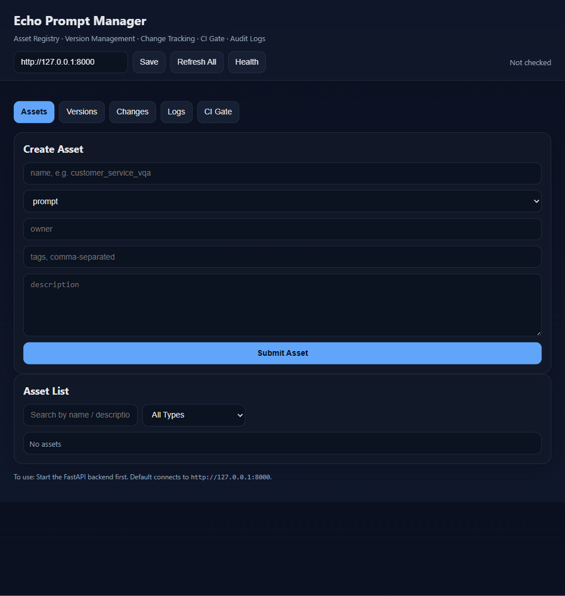

# Echo Prompt

Investor-facing showcase for a governed prompt operations layer that helps teams ship AI features with version control, reviewability, and execution traceability.

## Why It Exists

Teams building LLM-powered products often manage prompts, context, and workflow logic across scattered files, ad hoc dashboards, and manual deployment steps. That makes changes hard to review, hard to audit, and risky to ship.

Echo Prompt is designed to give those teams a single operational layer for prompt assets: what exists, which version is active, what changed, and how those changes performed over time.

## Core Product Capabilities

- Central registry for prompt assets, context packs, skills, and workflow definitions
- Version lifecycle management with draft, approved, active, and deprecated states
- Change tracking that links product updates to prompt asset changes
- Execution logging for latency, token usage, and request-level traceability
- Operator-facing UI for managing assets and reviewing state transitions
- API-first design so application services can consume approved prompt assets programmatically

## High-Level Architecture

Echo Prompt sits between AI application teams and the runtime systems that use prompt assets in production.

- Builders define and update prompt assets through a controlled interface
- Echo Prompt stores asset metadata, version state, and change history
- Application services retrieve approved versions through a stable service boundary
- Execution events can be written back for observability and auditability

More detail is available in [docs/architecture.md](docs/architecture.md).

## Product View

Sanitized UI capture from an internal prototype in an empty-state configuration:

## Current Status

Echo Prompt is currently in private alpha. The internal product already demonstrates the core control-plane concepts:

- asset and version objects
- lifecycle state management
- change registration
- execution-log capture
- a lightweight operator dashboard

This showcase repo is intentionally narrower than the internal system. It is meant to explain product direction and technical maturity, not reproduce the production implementation.

## What Is Included In This Public Showcase

- concise product overview
- high-level architecture documentation
- sanitized demo flow
- a safe UI screenshot
- example public-safe payloads that illustrate interface shape
- roadmap and diligence notes

See also [examples/sample-api-contract.md](examples/sample-api-contract.md) for sanitized interface examples.

## What Remains Private

- production backend implementation
- proprietary prompts, workflow definitions, and guardrail logic
- internal evaluation and release workflows
- deployment topology, secrets handling, and infrastructure details
- admin tooling, operational dashboards, and internal scripts
- customer data, sample logs, and non-public datasets

## Boundary Note

This repository is a curated public showcase. Core production systems and sensitive implementation details are intentionally omitted. Deeper technical diligence can be discussed separately on request.

## Diligence Access

For investor or partner diligence requests, contact the repository owner privately through GitHub or through an existing Echo Prompt diligence channel.
