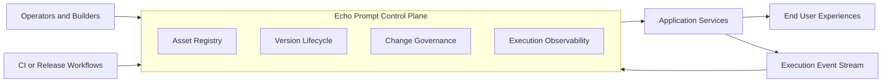

# Architecture Overview

This document describes the public-safe architecture of Echo Prompt at a conceptual level.

## System Role

Echo Prompt acts as a control plane for prompt-backed application behavior. It gives teams a governed way to define assets, activate approved versions, and record execution outcomes without embedding all prompt operations directly into application code.

## High-Level View

## Public-Safe Component Model

### Asset Registry

Stores the existence and metadata of prompt-related assets such as prompts, context packs, skills, and workflows.

### Version Lifecycle

Tracks which version is draft, approved, active, or deprecated so downstream systems can rely on a stable release state instead of ad hoc file changes.

### Change Governance

Associates prompt-related changes with review context and release decisions. This is important because prompt updates can change behavior materially even when application code does not.

### Execution Observability

Captures operational signals such as request metadata, latency, and token usage so teams can reason about the impact of prompt changes over time.

## Design Intent

The product is meant to separate:

- prompt asset operations
- application delivery workflows
- runtime consumption of approved assets

That separation reduces operational ambiguity and makes AI behavior easier to review and explain.

## Intentionally Omitted From This Public Diagram

The following are intentionally not documented here:

- production infrastructure topology
- internal service boundaries
- auth and tenancy implementation details
- private evaluation systems
- proprietary prompt structures and workflow logic
- deployment configuration and secrets management
